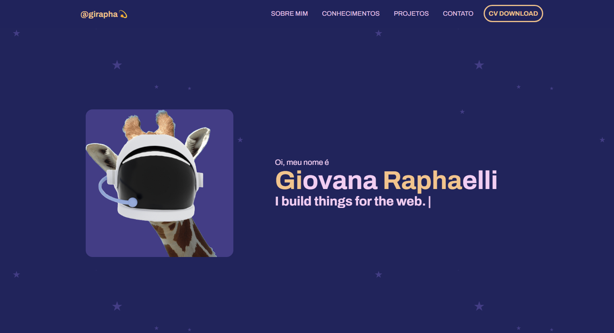

# portfolio
#### Meu portfólio pessoal desenvolvido com o objetivo de apresentar um pouco sobre mim e meus conhecimentos. Além de mostrar meus projetos ao decorrer de minha carreira..

<h4 align="center"><a href="https://giovanaraphaelli.vercel.app/">Clique para visitar o projeto</a></h4>

## 📚 Seções

O site é composto por 5 seções diferentes:

- **Intro:** Contém uma breve apresentação;
- **Sobre mim:** Contém uma descrição dizendo um pouco sobre quem sou;
- **Conhecimentos:** Apresento meus conhecimentos em algumas linguagens e o que sei sobre elas.
- **Projetos:** Exibe alguns projetos desenvolvidos, uma breve descricao e link para o projeto e repositório;
- **Contato:** Nessa sessão tenho as informações de contato;

## 💼 Tecnologias utilizadas

Para o desenvolvimento deste site utilizei as seguintes tecnologias:

- HTML;
- CSS;
- JavaScript;
- Boxicons;
- ScrollReveal;

## 🖌️ Inspirações de Design:

* [IuriCode](https://iuricode.vercel.app/)
* [Brittany Chiang](https://brittanychiang.com/)
* [Afua Deborah](https://afuadeborahcodes.com/)

